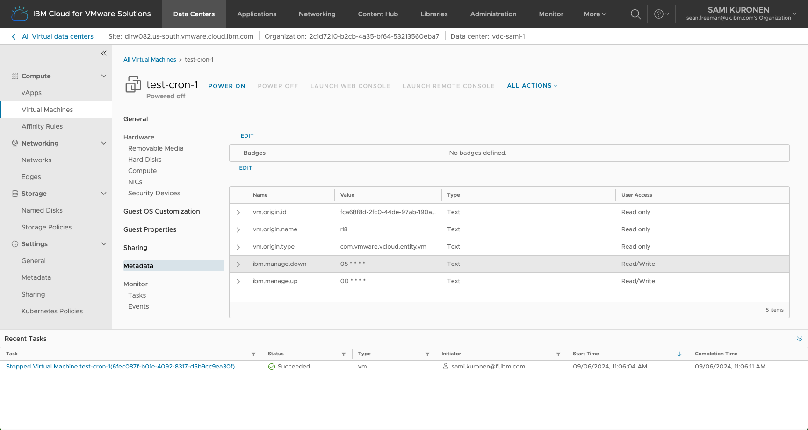

# VCFAAS Dynamic Workloads

This repo includes an idea to automate VCFAAS deployments to dynamically shutdown, suspend and start VMs and vApps on VDCs. 

## Overview

This example uses a python code (VCFaaS Virtual Machine Scheduler) to scheduled start and stop of Virtual Machine resources to better manage resource consumption. The solution uses CRON logic where each VM running scheduler is TAGged with two metadata entries (`ibm.manager.up` and `ibm.manager.down`). The scheduler is a long running process and as such will run as a background task. This task should be managed by a watchdog to ensure its continued availability. TAG updates are made dynamically meaning the process needs never be stopped.

IBM Cloud® Code Engine is a fully managed, serverless platform that runs your containerized workloads, including web apps, micro-services, event-driven functions, or batch jobs. Code Engine even builds container images for you from your source code. In this example, we use IBM Cloud® Code Engine to build a indefinitely running Code Engine job (daemon) to run the python code.

## Howto setup the environment

First, you need to deploy a VCFAAS instance on some of the sites. Then create your VMs and tag them with metadata (`ibm.manager.up` and `ibm.manager.down`). 

Current tags function as follows:

- `ibm.manage.up`: Start a virtual machine
- `ibm.manage.down`: Stop a virtual machine

Tag values indicate a series of time events described in the crontab format. A reasonable reference for this can be found here -> [https://crontab.guru](https://crontab.guru)

A tagged VM metadata should look like:

[Code engine scripts](./code_engine/README.md) are created to simplify the process to build an IBM Cloud® Code Engine project and an indefinitely running VCFaaS Virtual Machine Scheduler job running as a daemon.
